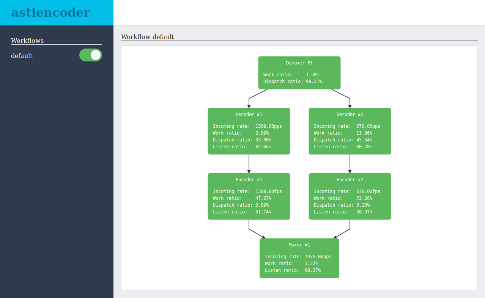
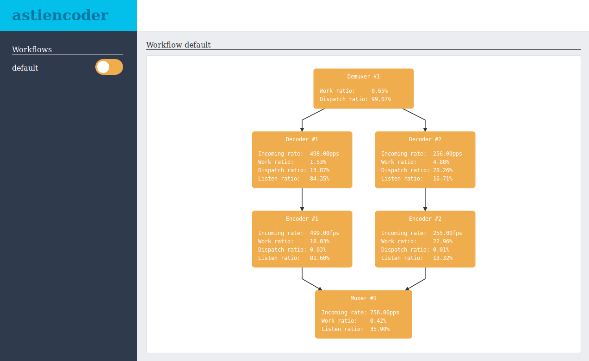
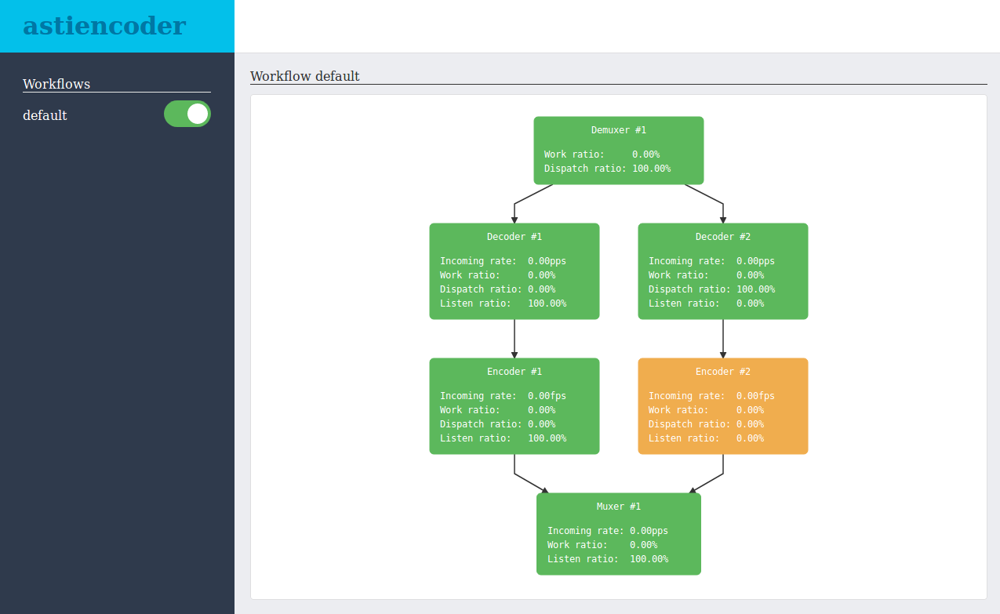

`astiencoder` is an open source video encoder written in GO and based on [ffmpeg](https://github.com/FFmpeg/FFmpeg) C bindings.

Right now this project has only been tested on FFMpeg 4.0.2.


# Why use this project when I can use `ffmpeg` binary?

In most cases you won't need this project as the `ffmpeg` binary is pretty awesome.

However, this project could be useful to you if you're looking to:

- understand how the video encoding process work
- integrate your video encoder in a GO ecosystem
- visualize your encoding workflow and statuses/stats of nodes in real time
- communicate with the encoder through an HTTP API + websocket to tweak behaviours in real time
- use native GO subtitle libraries like [astisub](https://github.com/asticode/go-astisub)
- build your own video encoder and take control of its workflow

# How is this project structured?
## The encoder framework

At the root of the project, package `astiencoder` provides the framework to build an [Encoder](encoder.go).
 
When provided with a `WorkflowBuilder`, it can build [Workflows](workflow.go) based on [Jobs](job.go).

At this point, [Workflows](workflow.go) are made of [Nodes](node.go) that can start/pause/continue/stop any kind of work. 
 
The [Encoder](encoder.go) has a built-in [Server](server.go) that serves both an HTTP API and WebSocket events to interact with [Workflows](workflow.go) and [Nodes](node.go).

All internal [Events](event.go) can be handled with the proper `EventHandler`.

## The libav wrapper

In folder `libav`, package `astilibav` provides the proper nodes to use the `ffmpeg` C bindings with the encoder:

- [Opener](libav/opener.go)
- [Demuxer](libav/demuxer.go)
- [Decoder](libav/decoder.go)
- [Filterer](libav/filterer.go)
- [Encoder](libav/encoder.go)
- [Muxer](libav/muxer.go)
- [PktDumper](libav/pkt_dumper.go)

At this point the way you connect those nodes is up to you since they implement 2 main interfaces:

```go
type PktHandler interface {
	HandlePkt(pkt *avcodec.Packet)
}

type FrameHandler interface {
	HandleFrame(f *avutil.Frame)
}
```

## The out-of-the-box encoder

In folder `astiencoder`, package `main` provides an out-of-the-box encoder using both packages `astiencoder` and `astilibav`.

It's a good place to start digging if you're looking to implement your own `WorkflowBuilder`.

# How do I install this project?
## FFMpeg

In order to use the `ffmpeg` C bindings, you need to install ffmpeg. To do so, run the following command:

```
$ make install-ffmpeg
```

In some cases, you'll need to enable/disable libs explicitly. To do so, use the `configure` placeholder. For instance this will install the `libx264` as well:

```
$ make install-ffmpeg configure="--enable-libx264 --enable-gpl"
```

## Astiencoder

Simply run the following command:

```
$ go get github.com/asticode/go-astiencoder/...
```

## Test everything is working fine

Simply run the following command:

```
$ make version
```

It should print something like:

```
avcodec: 3805796
avdevice: 3801956
avfilter: 462948
avutil: 3673700
resample: GPL version 2 or later
swscale: 328036
```

# How can I run the out-of-the-box encoder?
## Modes

The out-of-the-box encoder has 2 modes:

- by default it will spawn the server and wait for a new workflow to be added manually
- when provided with the `-j` flag, it will open the provided json-formatted job, transform it into a workflow, execute it and exit once everything is done

To run the default mode, simply run the following command:

```
$ make server
```

## Web UI

Whatever mode you're in, you can open the Web UI in order to either interact with your workflows or see their stats. 

By default it's accessible at http://127.0.0.1:4000 but you can change it using the encoder configuration.



### Add a new workflow

Click on the `+` icon on the top right of the screen:



Provide a name and the `.json` file containing your job:



Nice, you have added a new workflow!

### Start/pause/continue a workflow

On the left-hand side, you'll see the names of all the workflows you've added. Click once the slider on the right of its name to start the workflow:


Click a second time to pause it:


You can also start/pause/continue nodes individually by clicking on them:


### What do those stats mean?

Nodes use the same stats:

- Incoming rate: the number of incoming object received per second. This is either packets per second (`pps`) or frames per second (`fps`).
- Listen ratio: the percentage of time spent waiting for a new incoming object
- Dispatch ratio: the percentage of time spent waiting for all children to be available to process the output object.
- Work ratio: the percentage of time spent doing some actual work

That way you can monitor the efficiency of your workflow and see which node needs work.

# How can I run examples?

Examples are located in the `examples` folder and consists of json-formatted jobs.

If you want to run a specific example, run the following command:

```
$ make example=<name of the example>
```

File outputs will be written in the `examples/tmp` folder.

**WARNING**: for the following examples you will need specific ffmpeg libs enabled. Again, in order to do so, use the `configure` placeholder as mentioned [here](#ffmpeg):

- encode: `--enable-libx264 --enable-gpl`

# How can I build my own workflow?

If you're using the [Encoder](encoder.go), you'll need to use the `WorkflowBuilder` interface:

```go
type WorkflowBuilder interface {
	BuildWorkflow(j Job, w *Workflow) error
}
```

Otherwise, I'd recommend to get inspiration from the out-of-the-box encoder's [workflow builder](astiencoder/workflow.go).

# Which ffmpeg C bindings is this project using and why?

Right now this project is using [these bindings](https://github.com/asticode/goav).

Here's why:

1) [the base project](https://github.com/giorgisio/goav) is not maintained anymore
2) [this project](https://github.com/targodan/ffgopeg) is a hard fork of #1 but has gone a very different route
3) [this project](https://github.com/selfmodify/goav) is a fork of #1 but I'm experiencing lots of panics
4) [this project](https://github.com/amarburg/goav) is the best fork of #1 even though the last commit is not recent
5) [this project](https://github.com/ioblank/goav) is a fork of #4 with interesting additional commits
6) [this project](https://github.com/koropets/goav) is a fork of #4 with interesting additional commits
7) [this project](https://github.com/alon-ne/goav) has a very nice set of examples

Therefore I've forked #4, added useful commits from other forks and removed deprecated functions so that it works properly in FFMpeg 4.0.2.

# I'm not familiar with CGO, which flags am I supposed to provide?

If you're using `make`, you're not supposed to add CGO flags manually, it will do it for you.

Otherwise you need to provide the proper `CGO_CFLAGS`, `CGO_LDFLAGS` and `PKG_CONFIG_PATH` environment variables when running your GO code.

Let say the absolute path to your current dir is `/path/to`, here are their respective values:

- `CGO_CFLAGS`: -I/path/to/vendor_c/include
- `CGO_LDFLAGS`: -L/path/to/vendor_c/lib
- `PKG_CONFIG_PATH`: /path/to/vendor_c/lib/pkgconfig


# Features and roadmap

- [x] copy (remux)
- [x] mjpeg (thumbnails)
- [x] basic encode (h264 + aac)
- [x] stats
- [x] web ui
- [ ] proper tests
- [ ] [mosaic](https://trac.ffmpeg.org/wiki/Create%20a%20mosaic%20out%20of%20several%20input%20videos)
- [ ] audio resampling
- [ ] packaging (dash + hls + smooth)
- [ ] add plugin in [snickers](https://github.com/snickers/snickers/tree/master/encoders)
- [ ] many others :D

# Contribute

Contributions are more than welcome! Simply fork this project, make changes in a specific branch such as `patch-1` for instance and submit a PR.
